# Despliegue y configuración de LMS Moodle con Docker Compose

## Usuarios y contraseñas 
### MariaDB 
- MOODLE_DATABASE_USER=bn_moodle
- ALLOW_EMPTY_PASSWORD=yes

**Se recomienda configurar una contraseña modificando el archivo docker-compose.yml**
- MOODLE_DATABASE_PASSWORD= <<CONTRASEÑA>>
- ALLOW_EMPTY_PASSWORD=no
### Moodle 

**Credenciales para ingresar como administrador**
- USER=user
- PASSWORD=bitnami

## Despliegue con Docker Compose 

- Despliegue con docker compose siguiendo la documentación [bitnami/moodle](https://hub.docker.com/r/bitnami/moodle/#!)

  `curl -sSL https://raw.githubusercontent.com/bitnami/containers/main/bitnami/moodle/docker-compose.yml > docker-compose.yml
docker-compose up -d`

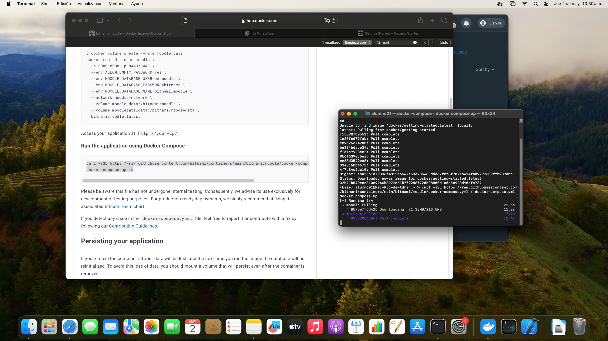

- Despligue con este repositorio

  `git clone https://github.com/delmylira48/LMS-Moodle.git`

  `cd LMS-Moodle`

  `docker compose up`

## Configuración de Moodle

### Paso 1) Ingresar al Moodle
 
Ingresamos en el navegador con `localhost` en el puerto `80`. Esto cargará la pagina principal de Moodle.
- http://localhost:80
- Damos click en `Log in`

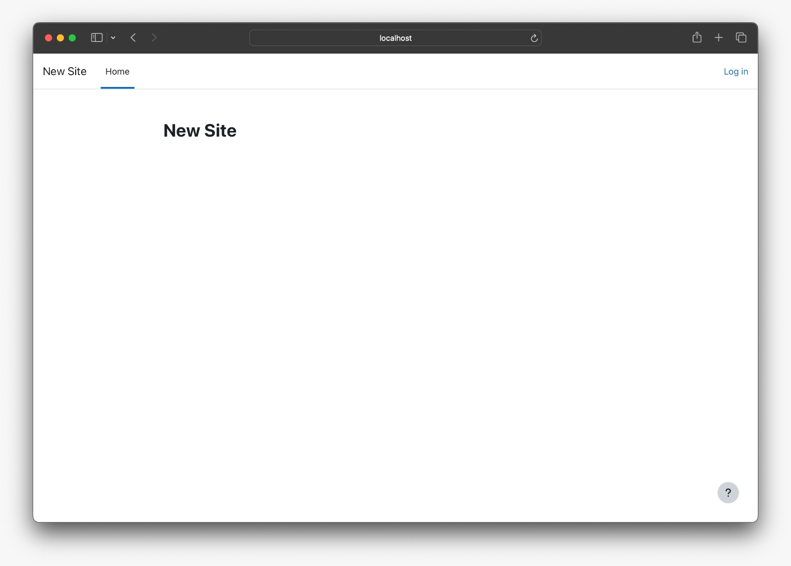

### Paso 2) Login Moodle
Capturar las credenciales y dar click en `Log in`
- User: User
- Password: bitnami

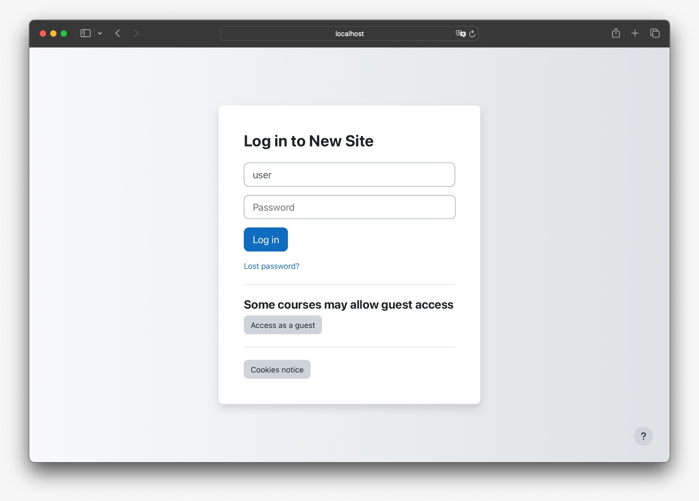

Una vez dentro, verás este panel de administador

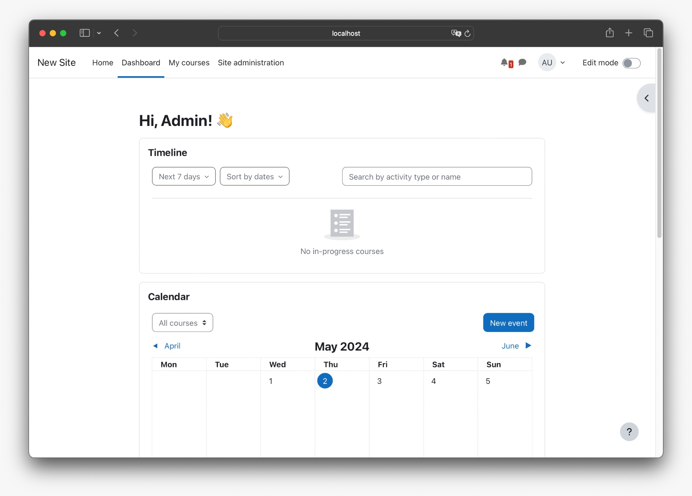 

### Paso 3) Crear nuevo usuario
Crear los usuarios necesarios:
- Click en `Site administration`
- Click en `Users`
- Click en `Add a new user`

A continuación llenar todos los campos requeridos y guardamos.

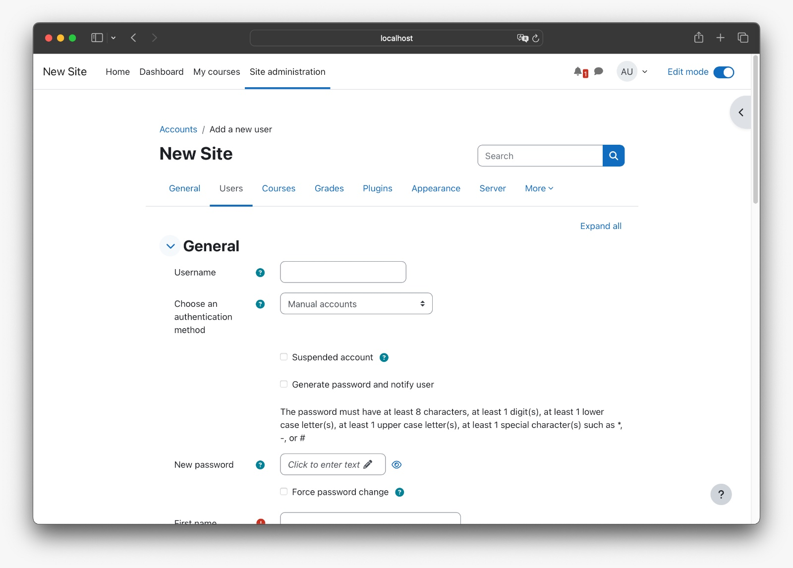

### Paso 4) Crear nuevo curso
- Click en `Site administration`
- Click en `Courses`

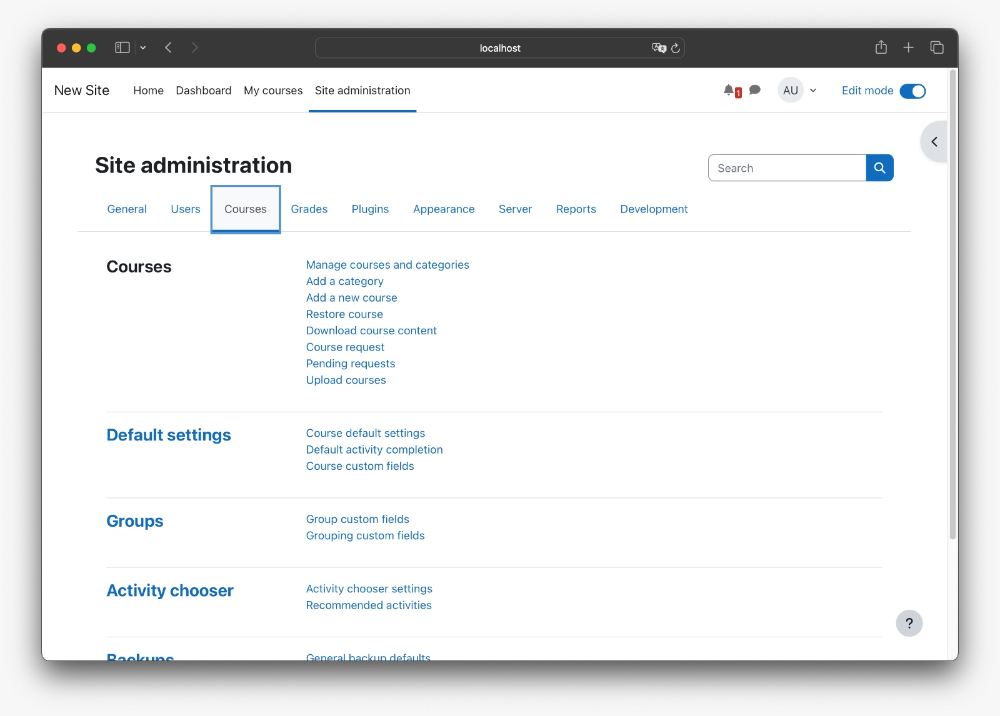

- Click en `Add a new course`

A continuación llenar todos los campos requeridos y guardamos.

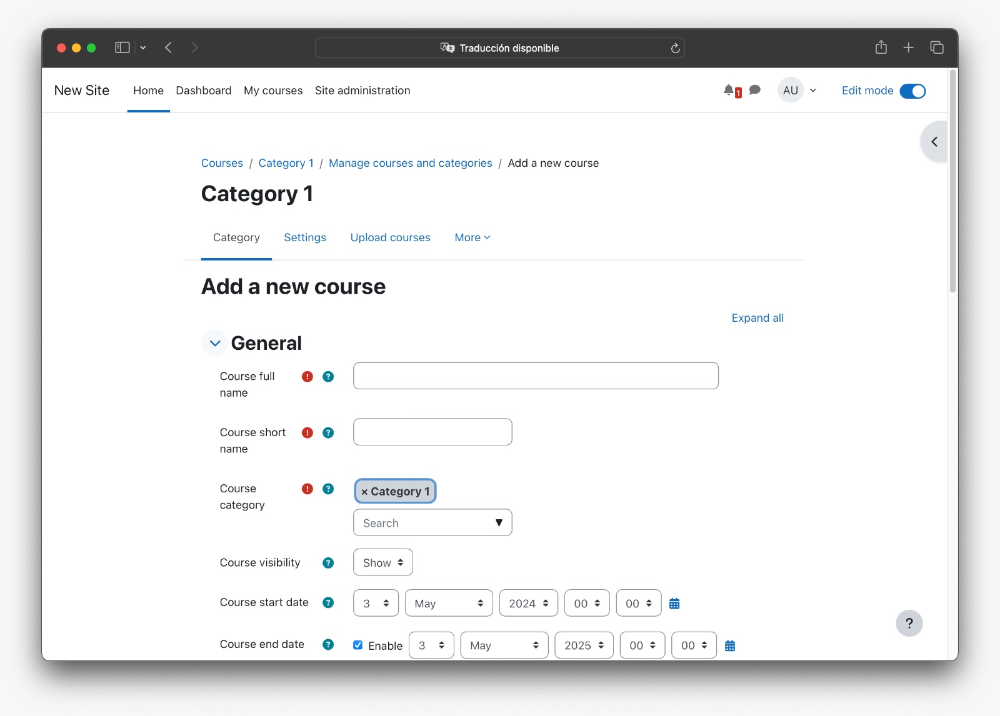

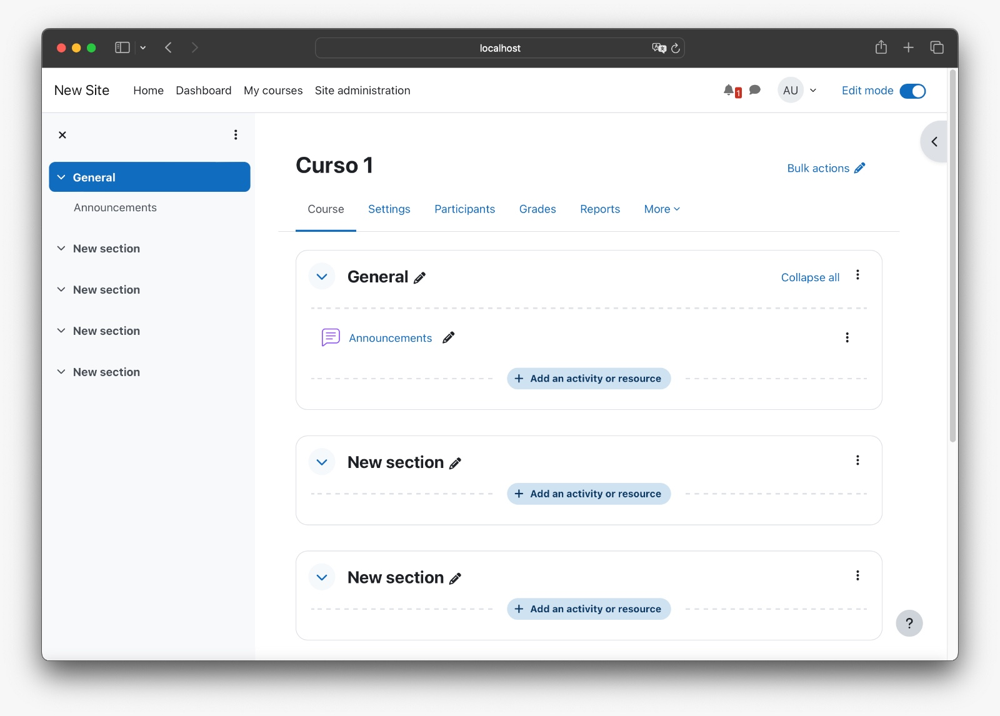

Para el siguiente paso dar click en `Participants`
### Paso 5) Agregar a los participantes al curso
- Click en `Enrol users`
- Buscar los participantes existentes y agregarlos

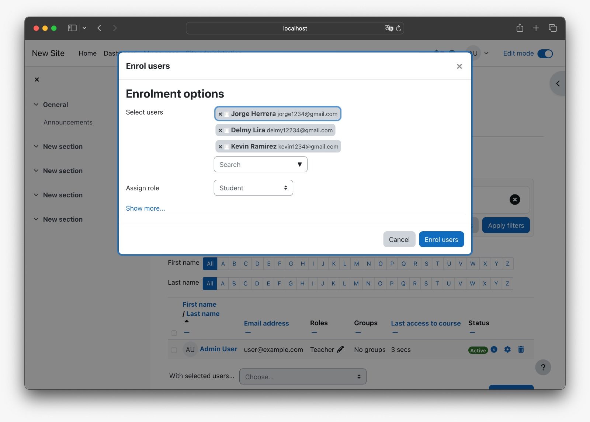

### Paso 6) Asignar roles a los participantes del curso
- Click en `Participants`

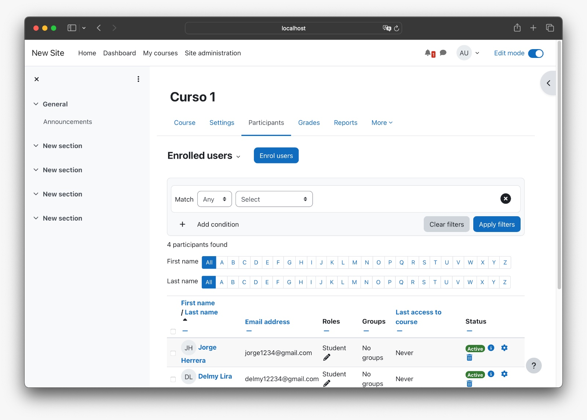
- Click en el icono de lapiz en la columna `Roles`
- Seleccionar todos los para asignar a cada participante

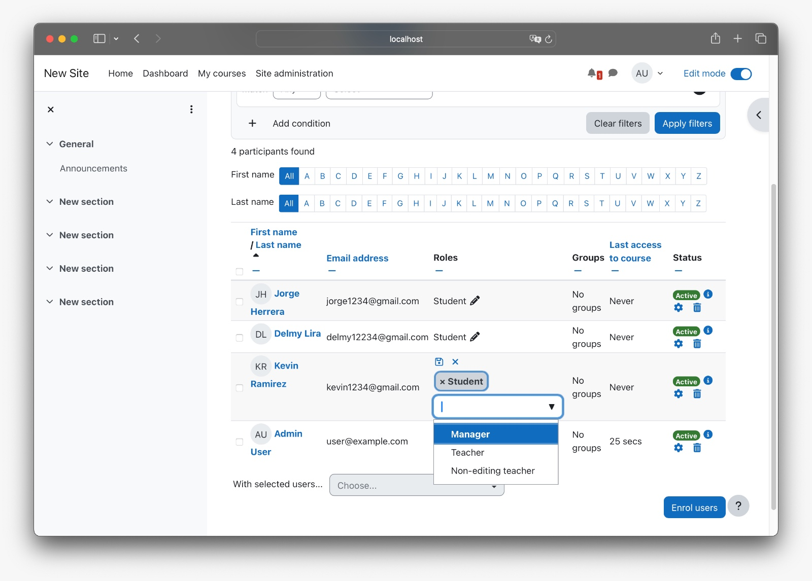

- Click en el icono de Guardar

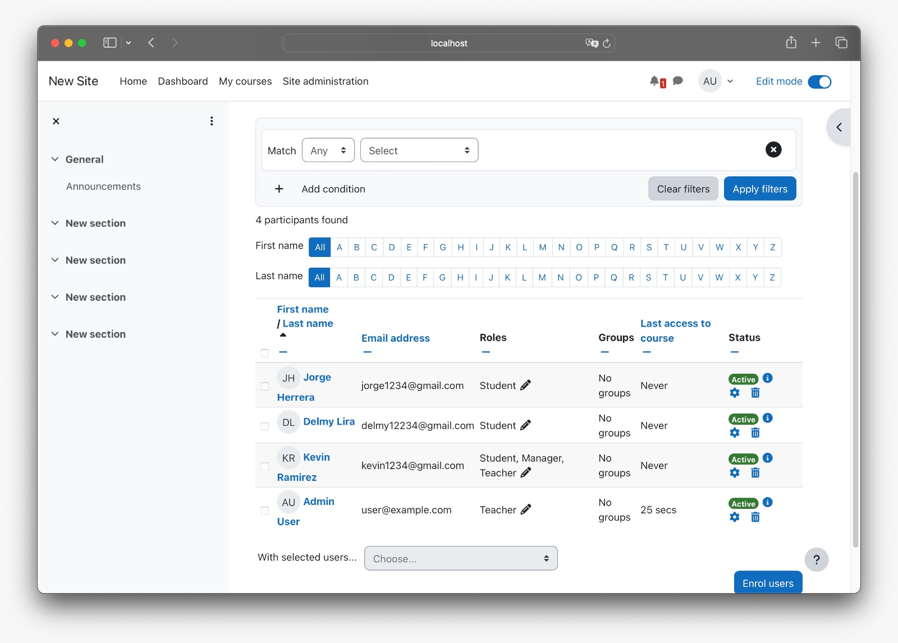

